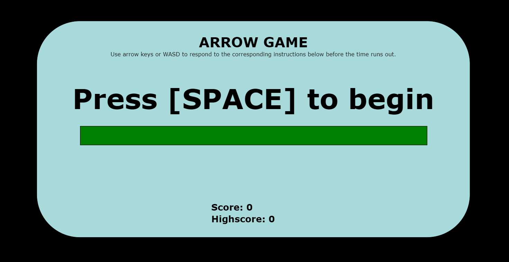
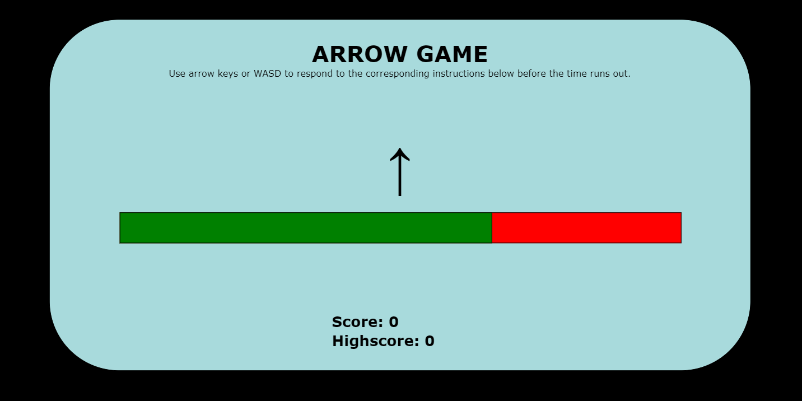
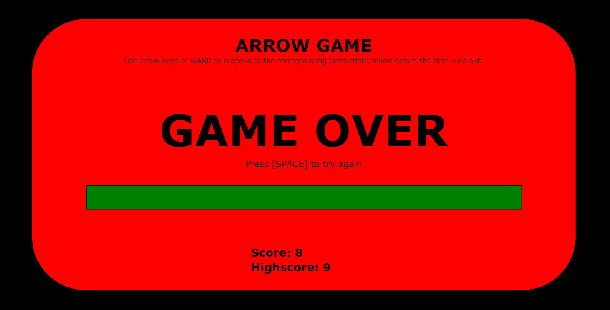
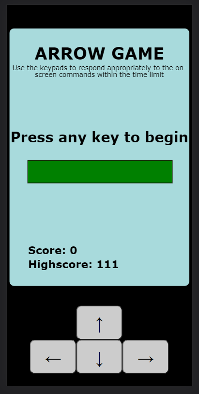

# Arrow game  
Click <a href='https://jspoh.github.io/projects/games/arrow_game/ag.html' target='_blank'>here</a> to play the game in your browser!  
Available on both desktop and mobile!

Game objective: Respond accordingly to the directional commands given before the time runs out!  
Features:  
- Easy to play, no need to install. Just visit the website!  
- Score and highscore system  

Fun fact: This is my first browser game!

## More about this game:  

  
Main starting screen  
 

  
This is what the gameplay looks like, you will receive arrow/text directional commands. Your goal is to react accordingly to the commands within the time limit indicated by the green/red time bar.  
 

  
This is what the gameover screen looks like. You will encounter a gameover if you choose the wrong input or if time runs out.  
 

  
When accessed on mobile, keypads will appear for you to use!  

Good luck, hope you have fun!
